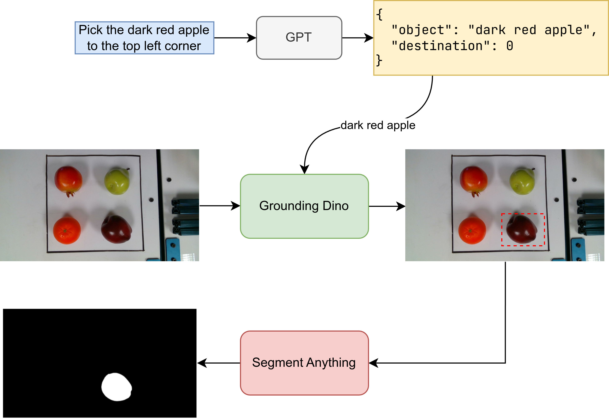

# NeuroGrip
This is the code repository for the NeuroGrip team  
This is intended for submission as the final course project for 16-662: Robot Autonomy at CMU

## Get Started

### Setup OPENAI api key

For this project, we use GPT to parse out text input, so we have to create a `.env` file to `src`

It should looks like

```
OPENAI_API_KEY=<YOUR-OPENAI-API-KEY>
```

### Install Python packages

- Python version: 3.8

It is recommend to use `conda` to create a virtual environment **when you are developing on your machine**

- [Install conda](https://www.anaconda.com/docs/getting-started/miniconda/install)

```bash
conda create -n neurogrip python=3.8
conda activate neurogrip

pip3 install -r requirements.txt
```

## Our work

### Text to target segmentation

This system enables natural language-driven object manipulation by integrating:

- GPT for text processing to convert user instructions into structured commands.
- Grounding Dino for object detection based on language descriptions.
- Segment Anything for fine-grained segmentation of the identified object.



#### How to launch

```bash
ssh student@172.26.165.203
pip3 install dotenv openai
roslaunch manipulation realsense.launch
```

#### How to use

```bash
cd src
python3 main.py 
# input your prompt
```

## Implementation videos

https://youtu.be/2TF8aYAhmj0

https://youtu.be/WbBWrO_oRvI